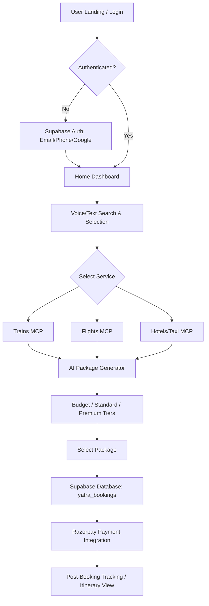

# YatraAI: Architecture & Application Workflow

## 🚀 Overview
YatraAI is a hyper-personalized travel destination recommendation and itinerary planning engine designed specifically for the Indian market. It addresses cultural, dietary, seasonal, and regional nuances (e.g., vegetarian availability, pilgrimage relevance, family-friendliness, and monsoon patterns).

---

## 🏛️ System Architecture

### Frontend
- **Framework**: Next.js 14+ (App Router)
- **Styling**: Tailwind CSS
- **Animations**: Framer Motion
- **Icons/UI**: Lucide React + Shadcn UI
- **State/Auth**: Context API + Supabase Auth

### Backend & Core Services
- **Database**: Supabase (PostgreSQL)
- **Authentication**: Supabase (Email/Phone OTP/Google/Password)
- **AI Middleware**: Custom MCP (Model Context Protocol) servers for:
  - **Flights MCP**: Real-time airline data and recommendations.
  - **Indian Railways MCP**: IRCTC status and route mapping.
  - **Taxi/Bus MCP**: Regional transport availability.
  - **Itinerary Engine**: AI generated packages (Budget, Standard, Luxury).
- **Payments**: Razorpay Integration (Production Flow).

---

## 🔄 Application Workflow

### 1. User Onboarding (Authentication)
1.  **Entry Point**: User lands on `LoginPage` (`/`).
2.  **Authentication**: Selects Email, Phone, Google, or Password.
3.  **Security**: Phone/Email OTP verification via Supabase.
4.  **Profile Sync**: Auto-creates/syncs user data in `profiles` table.
5.  **Redirect**: On successful auth, session is established and user is routed to `/home`.

### 2. Destination Discovery & Search
1.  **Intuitive Search**: User enters a destination or uses **Voice Search** (`Mic` interaction).
2.  **Filtering**: Selects trip dates, passengers, and Travel Category (Business, Leisure, Adventure).
3.  **AI Parsing**: The search query is analyzed for sentiment and intent (e.g., "looking for a peaceful monsoon trip with vegetarian food").
4.  **Dashboard**: Dynamic category selection (Trains, Flights, Buses, Hotels, Taxi).

### 3. Service Selection (Fetch Phase)
- **Real-time API Triggers**:
  - `fetchLiveTrains` -> calls `/api/mcp/live-trains`
  - `fetchLiveFlights` -> calls `/api/mcp/live-flights`
  - `fetchLiveHotels` -> calls `/api/mcp/live-hotels`
  - `fetchLiveTaxis` -> calls `/api/mcp/live-taxis`
- **MCP Response**: Returns current availability, pricing, and live tracking data.

### 4. AI Itinerary Generation (Trip Builder)
1.  **Selection**: User selects a transport/accommodation option.
2.  **Workflow Interaction**: `handleTripSelection` triggers the AI Package Modal.
3.  **Package Engine**:
    - Calls `/api/mcp/trip-packages` (POST origin, destination, dates, transport).
    - Generates 3 Tiers:
      - **Budget**: Focus on cost efficiency and public transport.
      - **Standard**: Balance of comfort and regional exploration.
      - **Premium**: Luxury stays, private taxis, and personalized guides.
4.  **Itinerary Logic**: Accounts for seasonal weather, festival calendars, and safety ratings.

### 5. Booking & Finalization
1.  **Itinerary Confirmation**: User clicks "Book Path" on their chosen package.
2.  **Data Persistence**: A new entry is created in `yatra_bookings` table in Supabase.
3.  **Payment Processing**: Triggers Razorpay payment flow.
4.  **Status Update**: Status moves from `Pending` -> `Upcoming` on payment success.
5.  **Tracking**: Booking details are available in the `/bookings` dashboard with real-time status prediction (PNR Prediction/Train tracking).

---

## 🛠️ Key Technical Components

| Component | Responsibility |
| :--- | :--- |
| **AuthContext** | Global state for user sessions and Supabase interaction. |
| **LanguageContext** | Dynamic translation/localization for multilingual support. |
| **AIIntelligence** | Component for context-aware travel tips and regional insights. |
| **PNRTracker** | Specialized module for Indian Railways ticket status tracking. |
| **MCP Tier** | Microservice layer for specialized travel data integration. |

---

## 🗺️ Mermaid Workflow Diagram

---
*Created by Antigravity AI - YatraAI Development Team*
